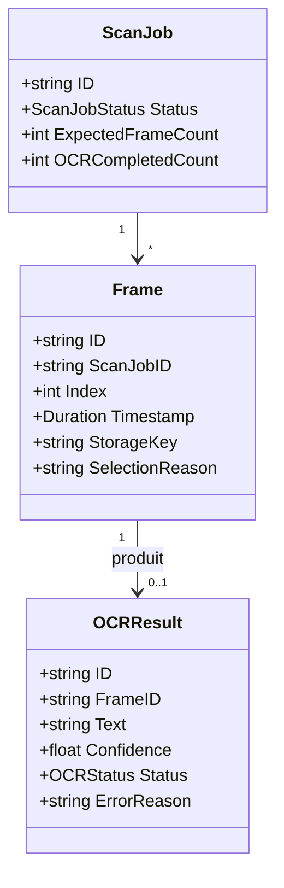
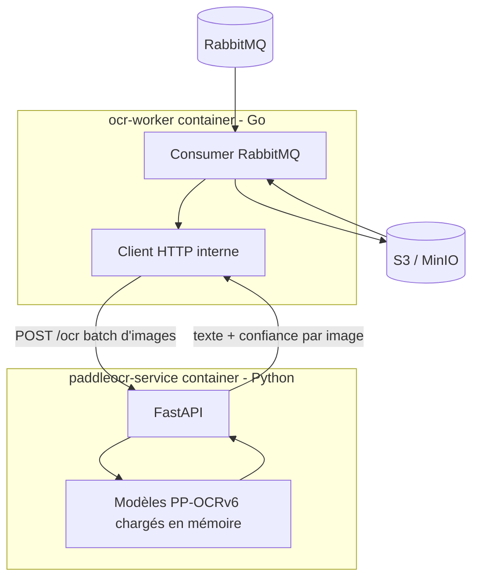
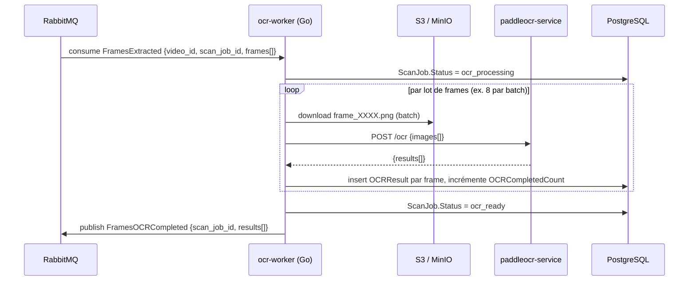

# leakcut — OCR local

Document détaillé sur le worker OCR : il consomme le résultat du `frame-extraction-worker` (événement `FramesExtracted`), lit le texte présent sur chaque frame retenue, et transmet ce texte en aval au classifieur (regex + JEV, hors scope ici — cf. doc d'architecture générale).

---

## 1. Choix du moteur OCR

Le comparatif 2026 des moteurs OCR open source est net sur ce point : Tesseract, longtemps la référence par défaut, n'est plus compétitif en précision face aux moteurs à base de deep learning. Un comparatif indépendant mesure un taux d'erreur caractère environ 4 fois plus élevé pour Tesseract 5 que pour PaddleOCR (PP-OCRv5) — autour de 18% contre 4-5% — avec un écart qui se creuse encore sur du texte bruité ou en scène (notre cas — captures d'écran compressées, UI variées) et sur le texte incliné, là où Tesseract décroche rapidement.

La dernière version en date renforce cet écart : PP-OCRv6 (PaddleOCR 3.7.0) gagne encore plusieurs points en détection comme en reconnaissance par rapport à la version précédente, unifie une cinquantaine de langues (dont le français et l'anglais) dans un seul modèle, et tourne significativement plus vite en CPU grâce à l'accélération OpenVINO — pas besoin de GPU pour un premier déploiement.

*Sources : comparatifs OCR open source 2026 (unstract.com/blog/best-opensource-ocr-tools, github.com/PaddlePaddle/PaddleOCR/wiki, modal.com/blog/8-top-open-source-ocr-models-compared).*

| Critère | Tesseract 5 | PaddleOCR (PP-OCRv6) |
|---|---|---|
| Taux d'erreur caractère | ~18% | ~4-5% |
| Texte incliné / bruité | Faible | Robuste |
| Multilingue | Bon (100+ langs, packs séparés) | 50 langues dans un seul modèle |
| Empreinte CPU | Très légère, rapide | Plus lourde, mais accélérable (OpenVINO, GPU) |
| Écosystème natif | C++ (bindings partout, dont Go) | Python (PaddlePaddle) |
| Licence | Apache 2.0 | Apache 2.0 |

**Choix retenu : PaddleOCR (PP-OCRv6).** Le seul vrai inconvénient — écosystème natif Python plutôt que Go — se résout facilement en l'exposant comme un petit service HTTP interne (cf. section 3), sans jamais sortir de l'infra locale. Le gain de précision est le critère décisif ici : un email ou une clé API mal lu par l'OCR, c'est une fuite qui passe entre les mailles.

---

## 2. Entités



| Entité | Rôle |
|---|---|
| `Frame` | Déjà connue du Frame Extraction Worker — on y ajoute la relation vers son résultat OCR |
| `OCRResult` | Le texte extrait d'une frame, avec un score de confiance et un statut (`success`, `failed`, `empty`) |
| `ScanJob.OCRCompletedCount` | Compteur incrémental utilisé pour savoir quand toutes les frames d'un job ont été traitées |

`OCRResult.Status = empty` distingue explicitement "l'OCR a tourné mais n'a rien trouvé" de "l'OCR a échoué" — utile pour ne pas masquer de vraies erreurs derrière des frames simplement sans texte (écran vide, image pure).

---

## 3. Architecture technique — service PaddleOCR interne



Deux containers pour ce worker, dans le même réseau Docker interne — **aucun appel externe**, ça reste "OCR local" au sens plein :

- **`ocr-worker`** (Go) : orchestration standard — consumer RabbitMQ, téléchargement des frames depuis S3/MinIO, appels au service PaddleOCR, publication de l'événement de sortie. Cohérent avec le reste de la stack (CQRS/event-driven Go).
- **`paddleocr-service`** (Python + FastAPI) : simple wrapper HTTP autour de PaddleOCR, modèles chargés une fois au démarrage (pas de rechargement par requête — c'est le principal coût de latence à éviter). Expose un seul endpoint batch.

Séparer les deux évite d'introduire cgo/bindings Python-dans-Go, et permet de scaler le service PaddleOCR indépendamment (plusieurs replicas si le débit d'images l'exige), sans toucher à l'orchestration Go.

**Contrat interne `POST /ocr`** (entre `ocr-worker` et `paddleocr-service`)
```json
// Requête
{
  "images": [
    { "frame_id": "frm_001", "image_base64": "..." },
    { "frame_id": "frm_002", "image_base64": "..." }
  ],
  "lang": "fr+en"
}

// Réponse
{
  "results": [
    { "frame_id": "frm_001", "text": "contact@example.com\nAPI_KEY=sk_live_...", "confidence": 0.94, "status": "success" },
    { "frame_id": "frm_002", "text": "", "confidence": 0.0, "status": "empty" }
  ]
}
```

Traitement par lots (batch) plutôt qu'image par image : PaddleOCR amortit mieux le coût d'inférence sur un batch, et ça réduit le nombre d'aller-retours HTTP internes.

---

## 4. Séquence



**Contrat de sortie** — événement `FramesOCRCompleted`
```json
{
  "scan_job_id": "job_01HXYZ",
  "video_id": "vid_01HXYZ",
  "results": [
    {
      "frame_id": "frm_001",
      "frame_index": 1,
      "timestamp_ms": 4200,
      "text": "contact@example.com\nAPI_KEY=sk_live_...",
      "confidence": 0.94,
      "status": "success"
    }
  ]
}
```

Publication **groupée** une fois tout le lot de frames traité (pas un événement par frame) — le classifieur en aval reçoit un seul message par `ScanJob`, cohérent avec l'approche "batch texte vers JEV" déjà retenue dans la doc d'architecture générale.

---

## 5. Configuration & performance

| Paramètre | Défaut | Notes |
|---|---|---|
| `lang` | `fr+en` | PaddleOCR PP-OCRv6 couvre les deux dans un seul modèle, pas de switch de modèle nécessaire |
| `batch_size` | 8 | Ajustable selon la RAM/CPU disponible du `paddleocr-service` |
| `min_confidence` | 0.5 | En dessous, `OCRResult.Status = failed` plutôt que de faire remonter du texte non fiable au classifieur |
| Accélération | OpenVINO (CPU) par défaut, GPU optionnel | Gain de vitesse CPU significatif sur PP-OCRv6 avec OpenVINO — suffisant pour du traitement par lot asynchrone, pas besoin de GPU dédié pour démarrer |

**Chargement des modèles** : les poids PP-OCRv6 doivent être présents dans l'image Docker `paddleocr-service` au build (pas de téléchargement au runtime) pour un démarrage rapide et reproductible, et pour rester utilisable en environnement sans accès réseau externe.

---

## 6. Gestion d'erreur

- **Échec d'une frame isolée** (image corrompue, texte illisible) → `OCRResult.Status = failed`, le worker continue le lot, n'échoue pas tout le `ScanJob` pour une seule frame.
- **Échec du service PaddleOCR** (timeout, service indisponible) → retry avec backoff sur le batch concerné ; après épuisement, `ScanJob.Status = ocr_failed`, DLQ.
- **Idempotence** : upsert des `OCRResult` par `frame_id`, un retry ne doit pas dupliquer les résultats ni relancer l'OCR sur des frames déjà traitées avec succès.
- **Complétude** : `ScanJob.OCRCompletedCount` comparé à `ScanJob.ExpectedFrameCount` (reçu via `FramesExtracted`) permet de savoir quand publier `FramesOCRCompleted` même si le traitement se fait par lots successifs.

---

## 7. Points d'attention

- **Confiance du texte, pas juste sa présence** : le seuil `min_confidence` évite de transmettre au classifieur du texte mal lu qui générerait de faux positifs (ou pire, de faux négatifs sur une clé API partiellement corrompue).
- **Le service PaddleOCR est stateless** : les modèles sont chargés en mémoire au démarrage, aucune donnée persistée côté service — scalable horizontalement sans coordination.
- **Décorrélation volontaire Go/Python** : le `ocr-worker` reste 100% Go comme le reste de la stack CQRS/event-driven ; seul le calcul d'inférence lourd sort en Python, encapsulé et invisible du reste du système (pas d'événement RabbitMQ publié par le service Python lui-même, uniquement par le worker Go).
- **Vidéos très longues** : le traitement par lot permet de streamer les `OCRResult` en base au fil de l'eau plutôt que d'attendre la fin de toutes les frames avant la première écriture — utile pour une UI qui afficherait une progression en temps réel.

---

## 8. Implémentation (leakcut-api)

Chaque tâche a son propre `Job` (`internal/domain/job`) : `extract_frames` à la confirmation d'upload, `ocr` à la fin de l'extraction (`UNIQUE (video_id, type)`).

| Pièce | Emplacement |
|---|---|
| Worker Go | `cmd/worker` — handler `ocr_frames_on_frames_extracted` sur `video.frames_extracted.v1` |
| Commande | `internal/application/command/video/ocr_frames.go` |
| Service OCR | `cmd/ocr/` — FastAPI `POST /ocr` (PaddleOCR) |
| Client HTTP | `internal/infrastructure/ocr/paddle.go` |
| Persistance | `ocr_results` + compteurs `jobs.expected_frame_count` / `jobs.ocr_completed_count` (migration `00010`) |
| Événement de sortie | `video.frames_ocr_completed.v1` (outbox → RabbitMQ) |
| Realtime | `job.updated` (`ocr_processing` / `ocr_ready` / `ocr_failed`) via le worker principal |
