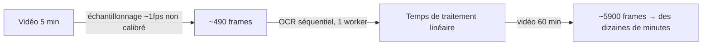
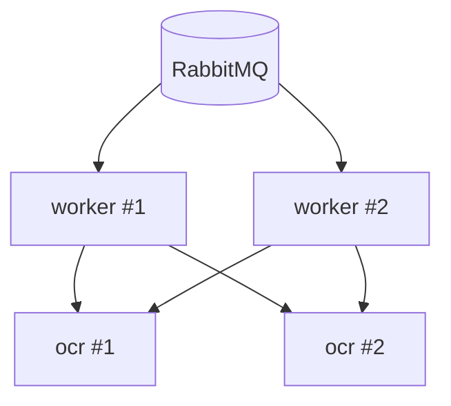
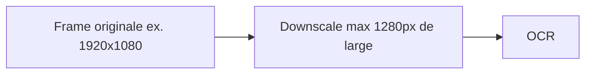
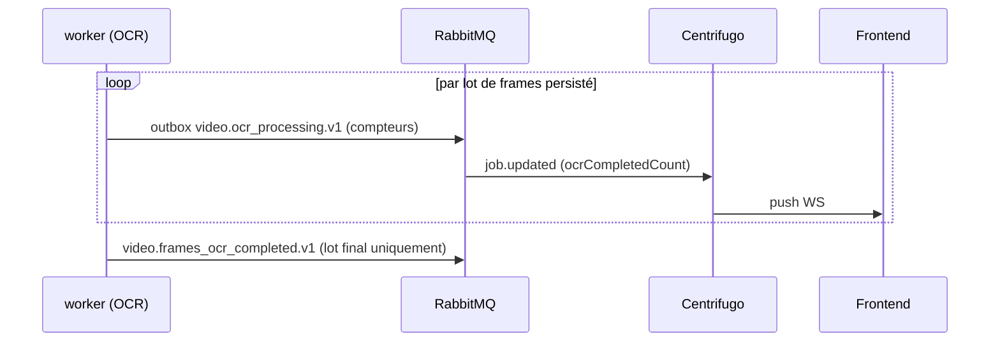

# leakcut — Optimisation performance (extraction + OCR)

Document dédié à la vitesse de traitement du pipeline amont (extraction de frames → OCR), suite au constat : une vidéo de 5 minutes échantillonnée à ~1 frame/seconde produit ~490 frames à faire passer par l'OCR, ce qui devient rédhibitoire sur des vidéos de 30-60 minutes en traitement séquentiel. Quatre leviers cumulables, du plus impactant au plus marginal.

---

## 1. Constat de départ



Le problème n'est pas l'OCR en lui-même (RapidOCR/onnxruntime est déjà rapide par image) mais le **volume de frames** combiné à un **traitement séquentiel**. Les deux se corrigent indépendamment.

---

## 2. Levier 1 — Réduire le nombre de frames retenues (le plus gros gain)

C'est le levier avec le meilleur ratio effort/impact : chaque frame en moins, c'est une frame en moins à télécharger, décoder, faire passer par le modèle, et classifier en aval.

### Recalibrage des paramètres de sélection (cf. doc Upload & découpage de frames, section 6.1)

| Paramètre | Valeur initiale | Valeur recalibrée | Effet |
|---|---|---|---|
| `analysis_fps` | 3 | 2 | Moins de frames décodées pour le calcul de diff lui-même (coût d'analyse, pas de rétention) |
| `diff_threshold` | 0.08 | 0.12-0.15 | Moins sensible aux petits changements (curseur qui bouge, clignotement de curseur texte) — ne retient que les vrais changements d'écran |
| `max_interval_seconds` | 10 | 15-20 | Le filet de sécurité se déclenche moins souvent sur du contenu statique prolongé |

Sur un tutoriel/démo d'écran typique (contenu statique 5-15s entre deux vrais changements), ce recalibrage seul fait passer le ratio d'environ 1 frame retenue/seconde à environ 1 frame retenue toutes les 5-8 secondes.

### Estimation d'impact

| Durée vidéo | Avant recalibrage (~1f/s) | Après recalibrage (~1f/6s) |
|---|---|---|
| 5 min | ~490 frames | ~50 frames |
| 30 min | ~1800 frames | ~300 frames |
| 60 min | ~3600 frames | ~600 frames |

Ces chiffres sont indicatifs — le vrai ratio dépend du contenu (une démo très dynamique retient plus, un tutoriel avec de longues pauses sur un même écran retient moins). Le seuil doit être validé empiriquement sur quelques vidéos réelles avant de figer les valeurs par défaut en prod (cf. point d'attention déjà noté dans la doc extraction).

---

## 3. Levier 2 — Paralléliser plutôt que traiter séquentiellement

Même avec moins de frames, un seul worker qui les traite une par une reste linéaire. Deux niveaux de parallélisation, cumulables :



### 3.1 Parallélisation inter-worker (scaling horizontal)

Une vidéo = un message `video.frames_extracted.v1` consommé par le `worker` Go. Les lots d'une même vidéo sont parallélisés **dans** ce worker (`OCR_BATCH_CONCURRENCY`, défaut 4). RabbitMQ répartit les **vidéos** entre plusieurs replicas `worker`. Le sidecar `ocr` (RapidOCR) se scale à part ; le client HTTP désactive le keep-alive pour répartir les requêtes.

```bash
docker compose -f compose.dev.yaml up -d --scale ocr=2 --scale frame=2 --scale classify=2
```

`make dev` démarre déjà `--scale ocr=2`. Le `worker` principal (outbox + realtime) reste singleton (`container_name: worker`). `ocr`, `frame` et `classify` n'ont pas de `container_name`.

### 3.2 Parallélisation intra-service (threading du moteur d'inférence)

Dans le sidecar `ocr` (RapidOCR + onnxruntime), `OCR_INTRA_OP_THREADS` (défaut 2) règle `ORT_INTRA_OP_NUM_THREADS` / `OMP_NUM_THREADS` **avant** le chargement du modèle. À calibrer selon les CPU du container — pas la totalité du host, pour éviter la contention déjà vue sur ARM.

### Impact combiné

| Configuration | Débit relatif |
|---|---|
| 1 worker, séquentiel | 1x (référence) |
| 4 workers, séquentiels chacun | ~4x |
| 4 workers + threading intra-op calibré | ~5-6x (gain marginal décroissant au-delà d'un certain nombre de threads par container) |

---

## 4. Levier 3 — Réduire la résolution avant OCR

Le coût d'inférence dépend directement de la taille de l'image, pas seulement de son contenu. Une frame de capture d'écran en 1080p ou plus contient largement plus de pixels que nécessaire pour lire du texte d'interface.



| Paramètre | Défaut proposé | Notes |
|---|---|---|
| `max_width_px` | 1280 | Le texte d'UI reste largement lisible à cette résolution ; ratio d'aspect conservé |
| Méthode | Downscale à l'extract (`ffmpeg` `scale=min(1280,iw)`) | Les PNG MinIO sont déjà à 1280 px max ; l'OCR et le `GET` detail lisent la même image |

Gain typique : 2-3x sur le temps d'inférence par image, sans perte mesurable de qualité de détection sur du texte d'interface (contrairement à une photo de document scanné, où la résolution compte plus).

---

## 5. Levier 4 — Ne jamais bloquer sur le résultat complet

Indépendant des trois leviers précédents : même avec un traitement encore long en absolu sur une vidéo d'1h, l'expérience utilisateur ne doit pas attendre la fin de tout le lot.



Chaque lot persisté republie `video.ocr_processing.v1` → realtime `job.updated` avec `ocrCompletedCount` / `expectedFrameCount`. Le front peut afficher la progression sans attendre `ocr_ready`.

`video.frames_ocr_completed.v1` reste **unique**, à la fin du job : c'est lui qui déclenche le worker `classify`. Ne pas le republier par lot.

---

## 6. Récapitulatif des leviers

| Levier | Effort | Impact | Où |
|---|---|---|---|
| Recalibrage diff/intervalle | Faible (config) | Le plus élevé — réduit le volume à la source | Frame Extraction Worker |
| Scaling horizontal des workers | Faible (docker compose) | Élevé, linéaire avec le nombre de replicas | `worker` (vidéos) + sidecar `ocr` |
| Threading intra-op | Faible (config) | Modéré, gain décroissant | sidecar `ocr` (`OCR_INTRA_OP_THREADS`) |
| Downscale à l'extract | Faible (ffmpeg) | Modéré à élevé (2-3x par image + moins de stockage) | frame worker (`FRAME_MAX_WIDTH_PX`, défaut 1280) |
| Publication incrémentale | En place | Pas de gain de temps réel, mais gain perçu | outbox `ocr_processing` → `job.updated` |

Sur une vidéo d'1h, la combinaison recalibrage + scaling horizontal + downscale devrait faire passer un traitement de plusieurs dizaines de minutes à quelques minutes, avec en plus une progression visible en direct grâce au levier 4.

---

## 7. Points d'attention

- **Calibrage empirique obligatoire** : les valeurs de `diff_threshold` et `max_interval_seconds` proposées ici sont des points de départ, à valider sur un corpus de vidéos réelles (tutoriels, démos produit) avant de les figer en défaut prod.
- **Scaling horizontal a un coût mémoire** : chaque replica du sidecar `ocr` charge RapidOCR/ONNX en mémoire — dimensionner les ressources allouées en conséquence avant de monter le nombre de replicas.
- **Ne pas sur-paralléliser le threading intra-op** en plus du scaling horizontal sans mesurer — les deux se disputent les mêmes cœurs CPU, un mauvais calibrage peut faire plus de mal (contention) que de bien.
- **Le downscale est unidirectionnel** : les coordonnées de findings restent liées au timestamp de la frame, pas à ses pixels — aucun impact sur la précision de la timeline, uniquement sur la vitesse de lecture OCR.
