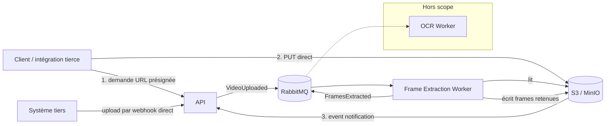
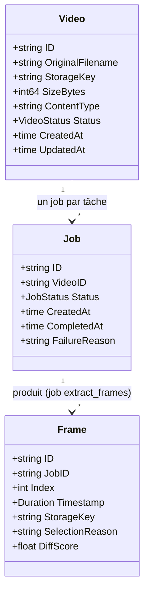
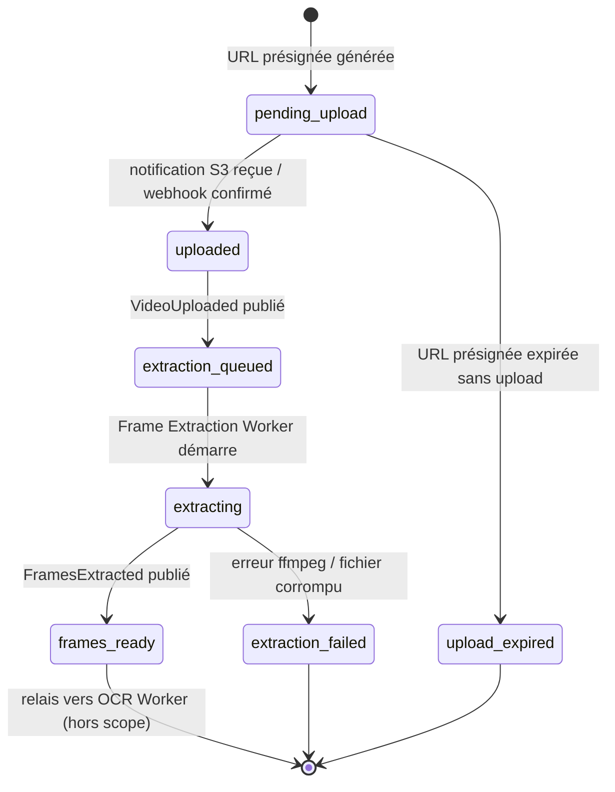
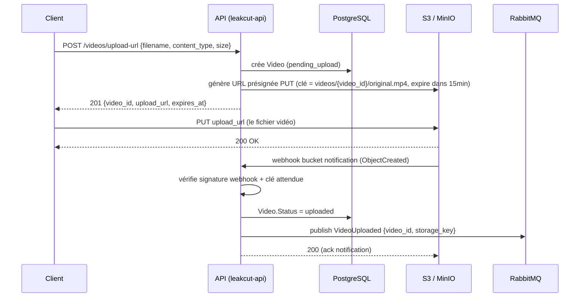
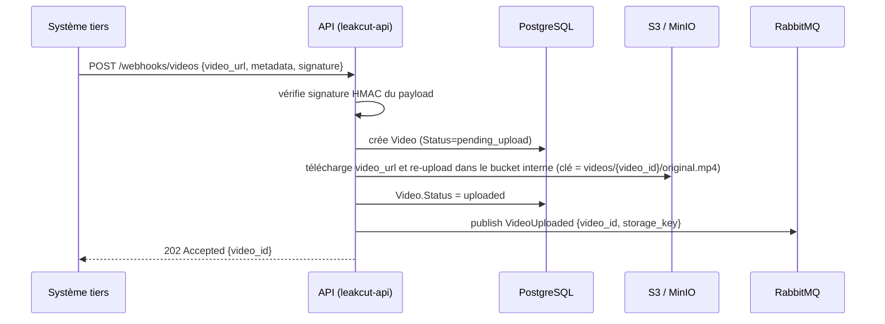
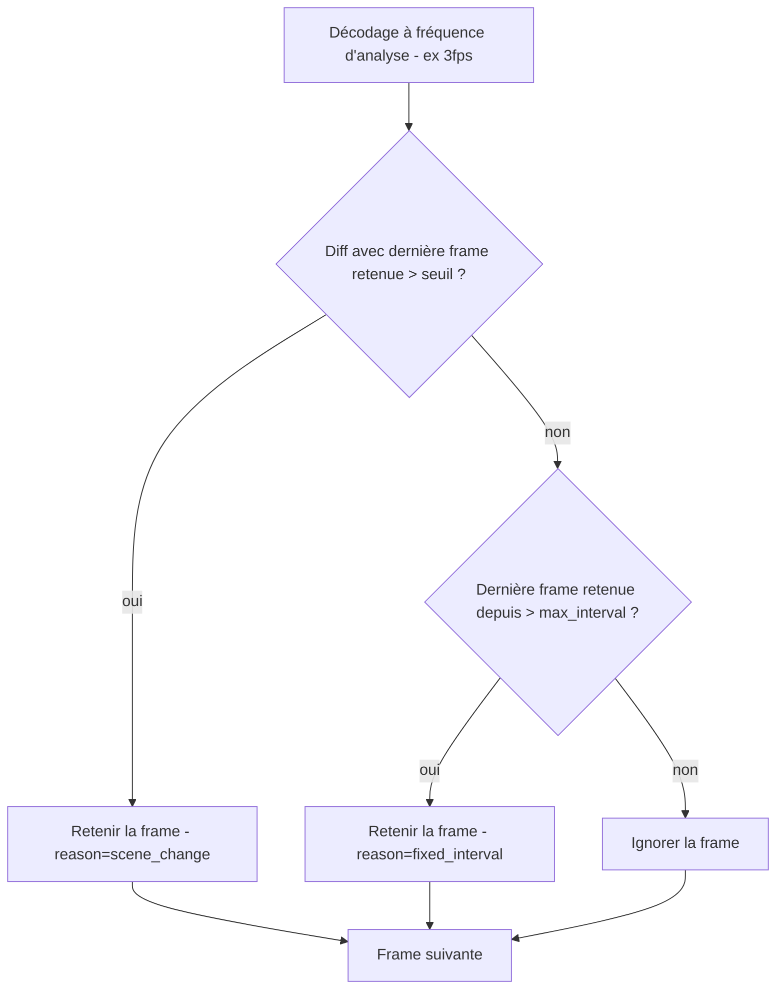
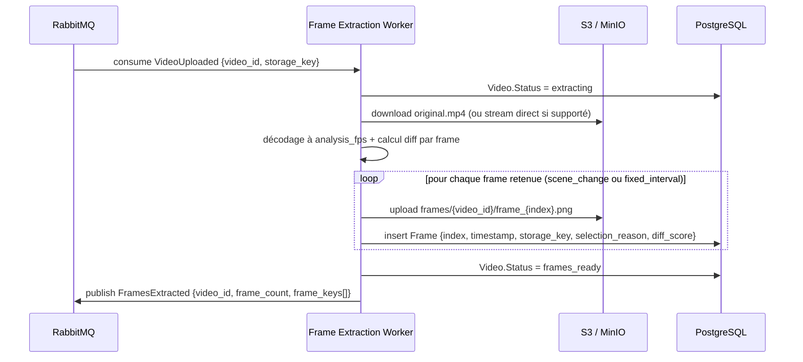

# leakcut — Upload & découpage de frames

Document détaillé sur le sous-domaine amont du pipeline : ingestion de la vidéo (URL présignée + webhooks) et découpage en frames par le `frame-extraction-worker`, avec stratégie d'échantillonnage hybride (fixe + détection de changement). L'OCR est hors scope de ce document — c'est un worker en aval qui consomme le résultat de l'extraction.

---

## 1. Périmètre



Deux méthodes d'ingestion couvertes ici :
1. **Upload via URL présignée** — le client uploade directement sur S3/MinIO, sans passer la vidéo par l'API.
2. **Upload via webhook** — soit une notification S3/MinIO confirmant qu'un objet est arrivé, soit un système tiers qui pousse une référence vidéo directement à l'API.

---

## 2. Entités



| Entité | Rôle |
|---|---|
| `Video` | La vidéo, identifiée dès la demande d'URL présignée (avant même l'upload effectif) |
| `Job` | Un job par tâche : `extract_frames` à l'upload confirmé, `ocr` à la fin de l'extraction |
| `Frame` | Une image **retenue** après extraction, avec sa clé de stockage, son timestamp, et pourquoi elle a été gardée (`SelectionReason`) |

`Frame.SelectionReason` distingue : `fixed_interval` (filet de sécurité) ou `scene_change` (diff détecté au-delà du seuil).

---

## 3. Machine à états

### `Video.Status`



| Statut | Déclenché par |
|---|---|
| `pending_upload` | `RequestUploadURLCommand` |
| `uploaded` | Notification S3/MinIO ou webhook tiers reçu et vérifié |
| `extraction_queued` | Publication de `VideoUploaded` |
| `extracting` | Frame Extraction Worker a consommé l'événement |
| `frames_ready` | Toutes les frames retenues extraites et uploadées sur S3/MinIO |
| `extraction_failed` | Erreur ffmpeg, timeout, ou fichier illisible |
| `upload_expired` | Job de nettoyage périodique détectant un `Video` encore `pending_upload` après expiration de l'URL présignée |

Le `Job.Status` suit en miroir côté pipeline global (`pending`, `extracting_frames`, `frames_ready`, `failed`) — `Video.Status` reste la source de vérité pour l'étape amont, `Job.Status` agrège l'ensemble du pipeline (extraction + OCR + classification + silences, cf. doc d'architecture générale).

---

## 4. Flux 1 — Upload via URL présignée



**Points clés**
- L'API ne voit jamais le contenu de la vidéo transiter par elle — uniquement le client et S3/MinIO.
- L'URL présignée porte une expiration courte (15 min ajustable) ; un job périodique passe les `Video` encore `pending_upload` après ce délai en `upload_expired`.
- La confirmation d'upload ne repose **pas** sur un appel du client ("j'ai fini d'uploader") mais sur la notification S3/MinIO elle-même — plus fiable, pas de dépendance à ce que le client rappelle l'API.
- MinIO en dev supporte les bucket notifications (webhook, AMQP direct vers RabbitMQ possible aussi — à évaluer : MinIO peut publier directement dans RabbitMQ sans repasser par l'API, ce qui simplifierait encore le flux si le format de notification MinIO convient tel quel).

---

## 5. Flux 2 — Upload via webhook (système tiers)



**Points clés**
- Contrairement au flux 1, ici c'est l'API qui télécharge la vidéo depuis l'URL fournie par le tiers et la rapatrie dans le bucket interne — on ne fait jamais confiance à une URL externe comme source de vérité durable (peut expirer, être supprimée côté tiers).
- Le téléchargement + re-upload peut être long pour de grosses vidéos : à faire de façon asynchrone dans l'API (goroutine + statut `pending_upload` maintenu) plutôt que de bloquer la requête webhook, avec réponse `202` immédiate.
- Vérification de signature obligatoire (HMAC partagé par intégration tierce) pour éviter qu'un webhook forgé ne fasse télécharger n'importe quelle URL par le serveur (risque SSRF) — liste blanche de domaines/IP à envisager en plus de la signature.

---

## 6. Frame Extraction Worker

### 6.1 Stratégie d'échantillonnage — hybride fixe + détection de changement

Extraire une frame par frame à 30fps est inutile : l'essentiel du contenu d'une vidéo de tutoriel/démo reste statique entre deux "vrais" changements d'écran. Deux mécanismes combinés :

1. **Détection de changement (mécanisme principal)** — ffmpeg décode les frames à une fréquence d'analyse plus élevée (ex. 2-5 fps, jamais 30fps complet) et calcule un score de diff entre frame courante et dernière frame **retenue** (pas la précédente, sinon un changement lent et continu ne serait jamais détecté). Au-delà d'un seuil, la frame est retenue.
   - Diff simple en premier jet : distance moyenne de pixels en niveaux de gris (rapide, pas de dépendance lourde).
   - Évolution possible : perceptual hash (pHash) si le diff pixel s'avère trop sensible au bruit vidéo (compression, grain).
2. **Intervalle fixe (filet de sécurité)** — si aucun changement n'est détecté pendant une durée `max_interval` (ex. 10s), une frame est retenue quand même. Ça évite un trou total sur un écran qui reste identique longtemps mais dont il faut quand même vérifier le contenu au moins une fois.



Ce mécanisme tourne **avant** tout upload S3 : seules les frames retenues sont uploadées et OCRisées en aval — c'est ce qui fait l'essentiel de l'économie de coût, plus encore que le choix du fps d'analyse.

**Paramètres de configuration** (par `Job`, avec valeurs par défaut raisonnables)

| Paramètre | Défaut | Rôle |
|---|---|---|
| `analysis_fps` | 2 | Fréquence à laquelle ffmpeg décode pour l'analyse de diff (pas la fréquence de rétention) |
| `diff_threshold` | 0.13 (13% de différence moyenne) | Seuil au-delà duquel une frame est considérée "changée" |
| `max_interval_seconds` | 15 | Intervalle max sans retenir de frame, même sans changement détecté |

### 6.2 Séquence



**Contrat d'entrée** — événement `VideoUploaded`
```json
{
  "video_id": "vid_01HXYZ",
  "storage_key": "videos/vid_01HXYZ/original.mp4",
  "content_type": "video/mp4"
}
```

**Contrat de sortie** — événement `FramesExtracted`
```json
{
  "video_id": "vid_01HXYZ",
  "job_id": "job_01HXYZ",
  "frame_count": 47,
  "frames": [
    {
      "index": 0,
      "timestamp_ms": 0,
      "storage_key": "frames/vid_01HXYZ/frame_000000.png",
      "selection_reason": "fixed_interval",
      "diff_score": 0.0
    },
    {
      "index": 1,
      "timestamp_ms": 4200,
      "storage_key": "frames/vid_01HXYZ/frame_000001.png",
      "selection_reason": "scene_change",
      "diff_score": 0.14
    }
  ]
}
```

`frame_count` reflète désormais uniquement les frames **retenues** (typiquement bien moins nombreuses qu'avec un échantillonnage fixe seul) — c'est ce nombre que le consumer de projection (dans l'API) utilise pour savoir combien de résultats OCR/regex attendre avant de considérer le scan complet.

**Layout de stockage S3/MinIO**
```
bucket: leakcut
├── videos/
│   └── {video_id}/
│       └── original.mp4
└── frames/
    └── {video_id}/
        ├── frame_000000.png
        ├── frame_000001.png
        └── ...
```
(uniquement les frames retenues sont présentes — pas de frames "candidates" rejetées stockées)

### 6.3 Gestion d'erreur

- Fichier vidéo corrompu ou codec non supporté par ffmpeg → `Video.Status = extraction_failed`, publication d'un événement `FrameExtractionFailed {video_id, reason}` pour notifier l'API (qui peut notifier l'UI), message routé en DLQ après épuisement des retries (3 tentatives, backoff exponentiel).
- Timeout d'extraction (vidéo très longue) → seuil configurable, même traitement que ci-dessus.
- Frames déjà présentes sur S3 pour ce `video_id` (cas de retry) → le worker doit être idempotent : vérifier/écraser plutôt que dupliquer, et ne pas réinsérer les lignes `Frame` en base si déjà présentes (upsert par `video_id + index`). Attention particulière en v2 : un retry doit rejouer le calcul de diff à l'identique (mêmes frames retenues) pour rester déterministe — le diff se fait toujours contre la dernière frame retenue, jamais contre un état externe non reproductible.

---

## 7. Endpoints API concernés

| Méthode | Route | Rôle |
|---|---|---|
| `POST` | `/videos/upload-url` | Demande une URL présignée (Flux 1) — command `RequestUploadURLCommand` |
| `POST` | `/webhooks/s3-notification` | Reçoit les notifications S3/MinIO (ou MinIO publie directement dans RabbitMQ, cf. note flux 1) |
| `POST` | `/webhooks/videos` | Ingestion tierce par référence (Flux 2) |
| `GET` | `/videos/{id}` | Statut courant de la vidéo (`Video.Status`), utile pour polling côté UI en complément du SSE |

---

## 8. Schéma de base (sous-domaine upload)

```sql
CREATE TABLE videos (
    id              UUID PRIMARY KEY,
    original_filename TEXT,
    storage_key     TEXT NOT NULL,
    size_bytes      BIGINT,
    content_type    TEXT,
    status          TEXT NOT NULL, -- pending_upload | uploaded | extraction_queued | extracting | frames_ready | extraction_failed | upload_expired
    created_at      TIMESTAMPTZ NOT NULL DEFAULT now(),
    updated_at      TIMESTAMPTZ NOT NULL DEFAULT now()
);

CREATE TABLE jobs (
    id              UUID PRIMARY KEY,
    video_id        UUID NOT NULL REFERENCES videos(id),
    status          TEXT NOT NULL,
    failure_reason  TEXT,
    analysis_fps    NUMERIC NOT NULL DEFAULT 3,
    diff_threshold  NUMERIC NOT NULL DEFAULT 0.08,
    max_interval_seconds INT NOT NULL DEFAULT 10,
    created_at      TIMESTAMPTZ NOT NULL DEFAULT now(),
    completed_at    TIMESTAMPTZ
);

CREATE TABLE frames (
    id                UUID PRIMARY KEY,
    job_id       UUID NOT NULL REFERENCES jobs(id),
    index             INT NOT NULL,
    timestamp_ms      BIGINT NOT NULL,
    storage_key       TEXT NOT NULL,
    selection_reason  TEXT NOT NULL, -- fixed_interval | scene_change
    diff_score        NUMERIC,
    UNIQUE (job_id, index)
);
```

---

## 9. Points d'attention

- **Calibrage du seuil de diff** : trop bas → trop de frames retenues (perd l'intérêt de l'optimisation) ; trop haut → rate de vrais changements de contenu. À valider empiriquement sur quelques vidéos réelles avant de figer la valeur par défaut.
- **Compression/bruit vidéo** : un diff pixel brut peut être sensible aux artefacts de compression sur des vidéos de mauvaise qualité — le pHash est la roue de secours si le seuil s'avère instable en pratique.
- **Sécurité webhook tiers** : signature HMAC obligatoire + liste blanche de domaines pour éviter le SSRF sur le téléchargement de `video_url`.
- **Expiration des URL présignées** : job de nettoyage périodique, sinon des `Video` en `pending_upload` s'accumulent indéfiniment.
- **Idempotence du Frame Extraction Worker** : redelivery RabbitMQ ne doit pas dupliquer les frames sur S3 ni en base, et un retry doit reproduire exactement la même sélection de frames.
- **MinIO → RabbitMQ direct** : à évaluer en dev — MinIO sait publier ses bucket notifications directement en AMQP, ce qui éviterait à l'API d'exposer un endpoint webhook dédié pour ça (à trancher selon le format de payload voulu pour `VideoUploaded`).
- **Taille des vidéos** : le Flux 2 (téléchargement + re-upload par l'API) est le point le plus sensible en cas de grosse vidéo — prévoir un stream direct (pas de buffer complet en mémoire) entre le download et l'upload S3.
